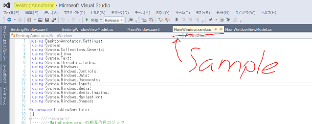

# DesktopAnnotator

## Project Description
DesktopAnnotator is a paint tool that allows you to write annotation on your desktop  
DesktopAnnotatorはデスクトップ画面にコメントなどを書き込むためのツールです。

## 使い方
1. ビルドして、出来上がった.exeファイルを任意の場所に置く
2. DesktopAnnotator.exeをタスクトレイにピン留めする
3. ピン留めしたアイコンをタップして起動

## How to use

1. Build project, and move .exe file to your own folder
2. Pin "DesktopAnnotator.exe" to taskbar
3. Start DesktopAnnotator by click pinned icon
